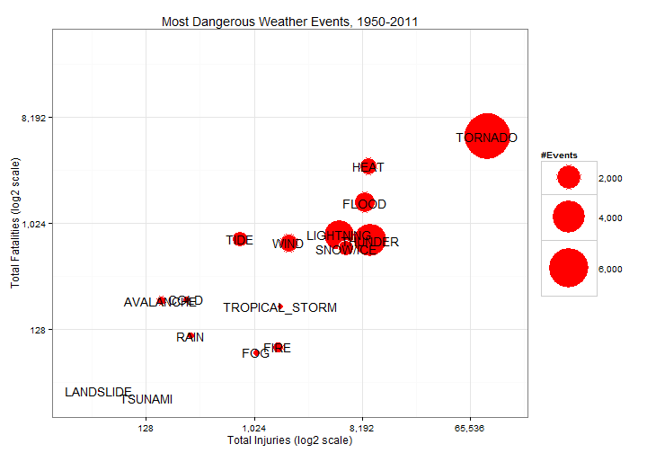
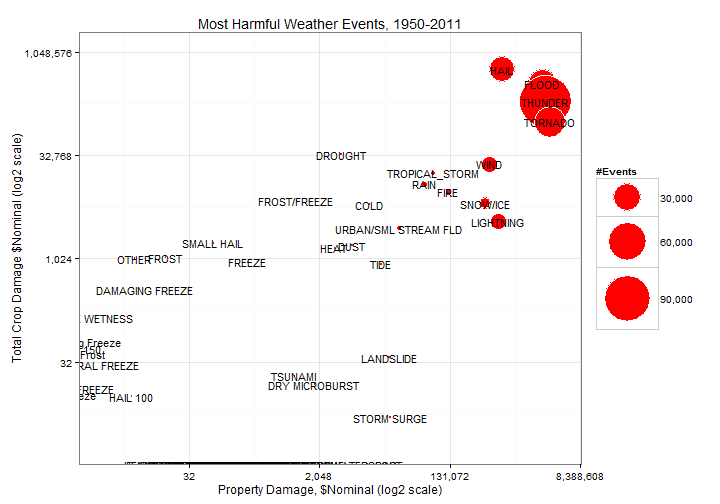

# Harm by Weather Events: Effects on Population Health, Crops, and Property
========================================
## Synopsis
This document summarizes the most harmful weather to the US population and to the US economy. It summarizes weather events in terms of deaths, injuries, and damage to crops and property. The data was collected by NOAA and consists of events from 1950 through November 2011. 

## Data Processing
The data consists of some 900K observations, and categorizes events among nearly 1,000 different Types.

```r
setwd("~/GitHub/Reproducible_2")
stormData <- read.csv("repdata-data-StormData.csv.bz2", stringsAsFactors = FALSE)
dim(stormData)
```

```
## [1] 902297     37
```

```r
length(table(stormData$EVTYPE))
```

```
## [1] 985
```

Several "types" were either misspelled or else poorly written, so for the purpose of this analysis I will group types into a few dozen smaller categories.

```r
stormData$CAT <- stormData$EVTYPE
stormData$CAT[grepl("TORNAD", stormData$CAT, ignore.case = T)] <- "TORNADO"
stormData$CAT[grepl("TSTM", stormData$CAT, ignore.case = T)] <- "THUNDER"
stormData$CAT[grepl("THUNDER", stormData$CAT, ignore.case = T)] <- "THUNDER"
stormData$CAT[grepl("FLOOD", stormData$CAT, ignore.case = T)] <- "FLOOD"
stormData$CAT[grepl("HEAT", stormData$CAT, ignore.case = T)] <- "HEAT"
stormData$CAT[grepl("WIND", stormData$CAT, ignore.case = T)] <- "WIND"
stormData$CAT[grepl("WINTER", stormData$CAT, ignore.case = T)] <- "SNOW"
stormData$CAT[grepl("BLIZZARD", stormData$CAT, ignore.case = T)] <- "SNOW"
stormData$CAT[grepl("FIRE", stormData$CAT, ignore.case = T)] <- "FIRE"
stormData$CAT[grepl("TIDE", stormData$CAT, ignore.case = T)] <- "TIDE"
stormData$CAT[grepl("CURRENT", stormData$CAT, ignore.case = T)] <- "TIDE"
stormData$CAT[grepl("RAIN", stormData$CAT, ignore.case = T)] <- "RAIN"
stormData$CAT[grepl("FOG", stormData$CAT, ignore.case = T)] <- "FOG"
stormData$CAT[grepl("HEAT", stormData$CAT, ignore.case = T)] <- "HEAT"
stormData$CAT[grepl("COLD", stormData$CAT, ignore.case = T)] <- "COLD"
stormData$CAT[grepl("SNOW", stormData$CAT, ignore.case = T)] <- "SNOW/ICE"
stormData$CAT[grepl("ICE", stormData$CAT, ignore.case = T)] <- "SNOW/ICE"
stormData$CAT[grepl("ICY", stormData$CAT, ignore.case = T)] <- "SNOW/ICE"
stormData$CAT[grepl("SURF", stormData$CAT, ignore.case = T)] <- "TIDE"
stormData$CAT[grepl("TROP", stormData$CAT, ignore.case = T)] <- "TROPICAL_STORM"
stormData$CAT[grepl("HURRIC", stormData$CAT, ignore.case = T)] <- "TROPICAL_STORM"
stormData$CAT[grepl("TYPHOON", stormData$CAT, ignore.case = T)] <- "TROPICAL_STORM"
stormData$CAT[grepl("TYPHOON", stormData$CAT, ignore.case = T)] <- "TROPICAL_STORM"
stormData$CAT[grepl("DUST", stormData$CAT, ignore.case = T)] <- "DUST"
```

Now let us create two reduced data sets, one including only to those involving fatalities or injuries called 'casualties,' and one involving only observations including property or crop damage, called 'harmEcon.'


```r
casualties <- stormData[stormData$FATALITIES > 0 | stormData$INJURIES > 0, ]
harmEcon <- stormData[stormData$PROPDMG > 0 | stormData$CROPDMG > 0, c(8, 25:28, 
    38)]
```

Now in the harmEcon data we add variables, PropertyDamage and CropDamage, which reflect the nominal dollar amount of damages. These are a function of the variables PROPDMG and PROPDMGEXP, and CROPDMG and CROPDMGEXP, respectively. In general, the variables with suffix EXP are interpreted to mean (k,K = 1,000), (m,M = 1 million), and (b,B = 1 billion). For the purpose of this analysis we will ignore the impact of inflation, which is outside the scope of the NOAA data set.


```r
harmEcon$PropertyDamage <- harmEcon$PROPDMG
harmEcon$PropertyDamage[harmEcon$PROPDMG %in% c("b", "B")] <- harmEcon$PROPDMG * 
    1e+09
harmEcon$PropertyDamage[harmEcon$PROPDMG %in% c("m", "M")] <- harmEcon$PROPDMG * 
    1e+06
harmEcon$PropertyDamage[harmEcon$PROPDMG %in% c("k", "K")] <- harmEcon$PROPDMG * 
    1000

harmEcon$CropDamage <- harmEcon$CROPDMG
harmEcon$CropDamage[harmEcon$CROPDMG %in% c("b", "B")] <- harmEcon$CROPDMG * 
    1e+09
harmEcon$CropDamage[harmEcon$CROPDMG %in% c("m", "M")] <- harmEcon$CROPDMG * 
    1e+06
harmEcon$CropDamage[harmEcon$CROPDMG %in% c("k", "K")] <- harmEcon$CROPDMG * 
    1000
```

Now we can tabulate by event type the number of instances involving casualties, the sum of fatalities by event type, and the sum of injuries by event type.


```r
unhealthy <- table(casualties$CAT)
fatalities <- tapply(casualties$FATALITIES, casualties$CAT, sum)
injuries <- tapply(casualties$INJURIES, casualties$CAT, sum)
```

Now let's create even smaller data frames consisting of the instance count, fatality/injury count, and property/crop damage by event type.


```r
danger <- data.frame(cbind(fatalities, injuries, unhealthy))
colnames(danger) <- c("Fatalities", "Injuries", "Events")
danger$Category <- rownames(danger)
dim(danger)
```

```
## [1] 63  4
```

```r

harmful <- table(harmEcon$CAT)
propHarm <- tapply(harmEcon$PropertyDamage, harmEcon$CAT, sum)
cropHarm <- tapply(harmEcon$CropDamage, harmEcon$CAT, sum)

harm <- data.frame(cbind(propHarm, cropHarm, harmful))
colnames(harm) <- c("Property", "Crops", "Events")
harm$Category <- rownames(harmful)
```

Let's reduce the data further to only those with 10 or more total fatalities + injuries, and damages of 10 or more, respectively. 


```r
danger2 <- danger[danger$Fatalities + danger$Injuries >= 10, ]
harm2 <- harm[harm$Property + harm$Crops > 10, ]
```


#Results
Tornados dominate weather events harmful to population health. The first plot below displays the most harmful weather events, fatalities vs. injuries. The size of the bubbles indicate the total count of such events. After Tornados, the next most dangerous event types include events involving Heat, and events involving Flooding. Tornados are also much more prevalent when it comes to weather events involving either injuries or fatalities.

In terms of economic damage, Hail dominated damage to crops, while Flood, Thunder, and Tornados are even more damaging than Hail when it comes to property. Thunder is by far the most prevelant weather event involved in property or crop damage.

I plot the data on log2 scales to accommodate such wide ranges of results.


```r
require(ggplot2)
library(scales)

ggplot(danger2, aes(x = Injuries, y = Fatalities, size = Events, label = Category), 
    guide = FALSE) + geom_point(colour = "white", fill = "red", shape = 21) + 
    scale_area(range = c(1, 25), name = "#Events", labels = comma) + scale_x_continuous(trans = "log2", 
    name = "Total Injuries (log2 scale)", limits = c(32, 2^17), labels = comma) + 
    scale_y_continuous(trans = "log2", name = "Total Fatalities (log2 scale)", 
        limits = c(32, 2^15), labels = comma) + geom_text(size = 5) + theme_bw() + 
    ggtitle("Most Dangerous Weather Events")
```



```r

ggplot(harm2, aes(x = Property, y = Crops, size = Events, label = Category), 
    guide = FALSE) + geom_point(colour = "white", fill = "red", shape = 21) + 
    scale_area(range = c(1, 25), name = "#Events", labels = comma) + scale_x_continuous(trans = "log2", 
    name = "Property Damage, $Nominal (log2 scale)", limits = c(2, 2^22), labels = comma) + 
    scale_y_continuous(trans = "log2", name = "Total Crop Damage $Nominal (log2 scale)", 
        limits = c(2, 2^20), labels = comma) + geom_text(size = 4) + theme_bw() + 
    ggtitle("Most Harmful Weather Events")
```




