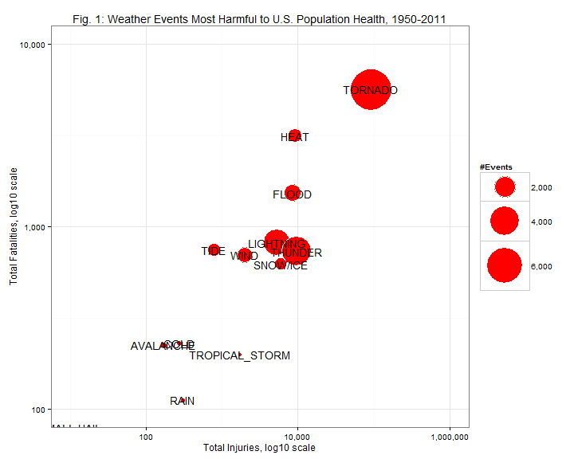
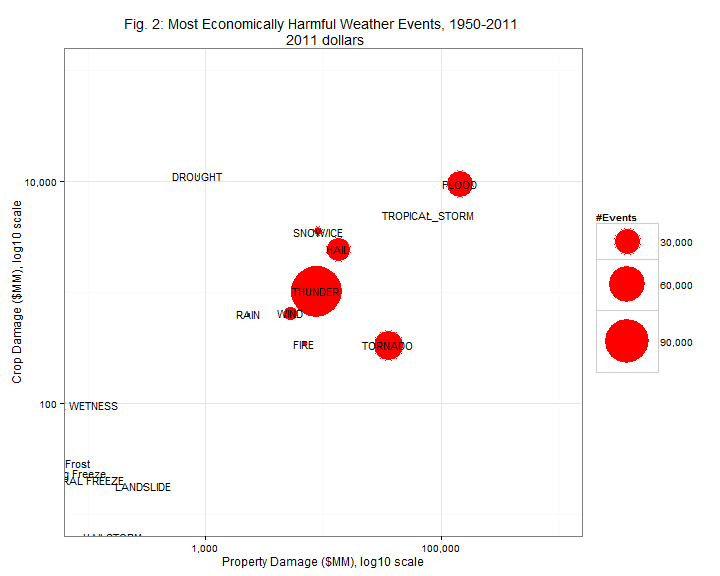

Harm by Weather Events: Effects on Population Health, Crops, and Property
========================================
# 1.0 Synopsis
This analysis summarizes the most harmful weather to the US population and to 
the US economy. It summarizes weather event categories most devastating in terms of deaths, injuries, and damage to crops and property. The data was collected by NOAA and consists of events from 1950 through November 2011. 

This analysis finds:

* Tornados are by far the weather event category most damaging to population health, whether measured by
injuries or fatalities

* Floods are the event category most damaging to property and crops combined. While extremely infrequent, Droughts are just as damaging to crops. Tropical storms, also extremely infrequent, are nearly as damaging as Floods to property and crops.

# 2.0 Data Processing
The data consists of some 900K observations, and categorizes events among nearly 1,000 different Types.


```r
setwd("~/GitHub/Reproducible_2")
stormData <- read.csv("repdata-data-StormData.csv.bz2", stringsAsFactors = FALSE)
dim(stormData)
```

```
## [1] 902297     37
```

```r
length(table(stormData$EVTYPE))
```

```
## [1] 985
```

## 2.1 Import CPI and determine deflators by year
We also need to adjust nominal dollar amounts into 2011 equivalents, so we will 
import annual CPI from the US Bureau of Labor Statistics
(http://data.bls.gov/pdq/querytool.jsp?survey=cu, last accessed 3/21/2013)

```r
annual_CPI <- read.csv("annual_CPI.csv")
cpiDeflator <- annual_CPI$CPI/annual_CPI$CPI[annual_CPI$Year == 2011]
cpiDeflator <- data.frame(cbind(annual_CPI$Year, cpiDeflator))
colnames(cpiDeflator) <- c("Year", "Deflator")
```

## 2.2 Identify year of each event
To convert the dollar amounts in the damages columns to 2011 dollars. We will 
start by adding a year variable based on BGN_DATE, and convert the *DMG amounts 
accordingly

```r
require(lubridate)
```

```
## Loading required package: lubridate
```

```r
stormData$YEAR <- year(strptime(stormData$BGN_DATE, "%m/%d/%Y %H:%M:%S"))
```

## 2.3 Group similar and misspelled event types into broader categories
Several "types" were either misspelled or else poorly written, so for the 
purpose of this analysis I will group types into a few dozen smaller categoriesthat make sense to me. Grouping differently could change the final results.

```r
stormData$CAT <- stormData$EVTYPE
stormData$CAT[grepl("TORNAD", stormData$CAT, ignore.case = T)] <- "TORNADO"
stormData$CAT[grepl("TSTM", stormData$CAT, ignore.case = T)] <- "THUNDER"
stormData$CAT[grepl("THUNDER", stormData$CAT, ignore.case = T)] <- "THUNDER"
stormData$CAT[grepl("FLOOD", stormData$CAT, ignore.case = T)] <- "FLOOD"
stormData$CAT[grepl("HEAT", stormData$CAT, ignore.case = T)] <- "HEAT"
stormData$CAT[grepl("WIND", stormData$CAT, ignore.case = T)] <- "WIND"
stormData$CAT[grepl("WINTER", stormData$CAT, ignore.case = T)] <- "SNOW"
stormData$CAT[grepl("BLIZZARD", stormData$CAT, ignore.case = T)] <- "SNOW"
stormData$CAT[grepl("FIRE", stormData$CAT, ignore.case = T)] <- "FIRE"
stormData$CAT[grepl("TIDE", stormData$CAT, ignore.case = T)] <- "TIDE"
stormData$CAT[grepl("CURRENT", stormData$CAT, ignore.case = T)] <- "TIDE"
stormData$CAT[grepl("RAIN", stormData$CAT, ignore.case = T)] <- "RAIN"
stormData$CAT[grepl("FOG", stormData$CAT, ignore.case = T)] <- "FOG"
stormData$CAT[grepl("HEAT", stormData$CAT, ignore.case = T)] <- "HEAT"
stormData$CAT[grepl("COLD", stormData$CAT, ignore.case = T)] <- "COLD"
stormData$CAT[grepl("SNOW", stormData$CAT, ignore.case = T)] <- "SNOW/ICE"
stormData$CAT[grepl("ICE", stormData$CAT, ignore.case = T)] <- "SNOW/ICE"
stormData$CAT[grepl("ICY", stormData$CAT, ignore.case = T)] <- "SNOW/ICE"
stormData$CAT[grepl("SURF", stormData$CAT, ignore.case = T)] <- "TIDE"
stormData$CAT[grepl("TROP", stormData$CAT, ignore.case = T)] <- "TROPICAL_STORM"
stormData$CAT[grepl("HURRIC", stormData$CAT, ignore.case = T)] <- "TROPICAL_STORM"
stormData$CAT[grepl("TYPHOON", stormData$CAT, ignore.case = T)] <- "TROPICAL_STORM"
stormData$CAT[grepl("TYPHOON", stormData$CAT, ignore.case = T)] <- "TROPICAL_STORM"
stormData$CAT[grepl("DUST", stormData$CAT, ignore.case = T)] <- "DUST"
```

## 2.4 Create casualties subset and economic harm subset
Now let us create two reduced data sets, one including only to those involving fatalities or injuries called 'casualties,' and one involving only observations including property or crop damage, called 'harmEcon.'

```r
casualties <- stormData[stormData$FATALITIES > 0 | stormData$INJURIES > 0, ]
harmEcon <- stormData[stormData$PROPDMG > 0 | stormData$CROPDMG > 0, ]
```

## 2.5 Convert damages according to the units indicated
Now in the harmEcon data we add variables, PropertyDamage and CropDamage, which 
initially reflect the nominal dollar amount of damages. These are a function of the variables PROPDMG and PROPDMGEXP, and CROPDMG and CROPDMGEXP, respectively. In general, the variables with suffix EXP are interpreted to mean (k,K = 1,000), (m,M = 1 million), and (b,B = 1 billion). Later we will convert the nominal dollar amounts to 2011 dollars using the CPI deflators.

```r
harmEcon$PropertyDamage <- harmEcon$PROPDMG
harmEcon$PropertyDamage[harmEcon$PROPDMGEXP %in% c("b", "B")] <- harmEcon$PROPDMG[harmEcon$PROPDMGEXP %in% 
    c("b", "B")] * 1e+09
harmEcon$PropertyDamage[harmEcon$PROPDMGEXP %in% c("m", "M")] <- harmEcon$PROPDMG[harmEcon$PROPDMGEXP %in% 
    c("m", "M")] * 1e+06
harmEcon$PropertyDamage[harmEcon$PROPDMGEXP %in% c("k", "K")] <- harmEcon$PROPDMG[harmEcon$PROPDMGEXP %in% 
    c("k", "K")] * 1000

harmEcon$CropDamage <- harmEcon$CROPDMG
harmEcon$CropDamage[harmEcon$CROPDMGEXP %in% c("b", "B")] <- harmEcon$CROPDMG[harmEcon$CROPDMGEXP %in% 
    c("b", "B")] * 1e+09
harmEcon$CropDamage[harmEcon$CROPDMGEXP %in% c("m", "M")] <- harmEcon$CROPDMG[harmEcon$CROPDMGEXP %in% 
    c("m", "M")] * 1e+06
harmEcon$CropDamage[harmEcon$CROPDMGEXP %in% c("k", "K")] <- harmEcon$CROPDMG[harmEcon$CROPDMGEXP %in% 
    c("k", "K")] * 1000
```

## 2.6 Convert all damage amounts into 2011 dollars
Now we convert the nominal damage amounts to 2011 dollars by multiplying by the
respective deflator for the year they began.

```r
harmEcon$Deflator <- unlist(lapply(harmEcon$YEAR, function(x) cpiDeflator$Deflator[cpiDeflator$Year == 
    x]))

harmEcon$PropertyDamage <- harmEcon$PropertyDamage * harmEcon$Deflator
harmEcon$CropDamage <- harmEcon$CropDamage * harmEcon$Deflator
```

## 2.7 Tabulate count, fatalities, and injuries by category
Now we can tabulate by event type the number of instances involving casualties, the sum of fatalities by event type, and the sum of injuries by category.

```r
unhealthy <- table(casualties$CAT)
fatalities <- tapply(casualties$FATALITIES, casualties$CAT, sum)
injuries <- tapply(casualties$INJURIES, casualties$CAT, sum)

danger <- data.frame(cbind(fatalities, injuries, unhealthy))
colnames(danger) <- c("Fatalities", "Injuries", "Events")
danger$Category <- rownames(danger)
dim(danger)
```

```
## [1] 63  4
```

## 2.8  Tabulate count, property damage and crop damage by category
Now let us create even smaller data frames consisting of the instance count, fatality/injury count, and property/crop damage by category.

```r
harmful <- table(harmEcon$CAT)
propHarm <- tapply(harmEcon$PropertyDamage, harmEcon$CAT, sum)
cropHarm <- tapply(harmEcon$CropDamage, harmEcon$CAT, sum)

harm <- data.frame(cbind(propHarm, cropHarm, harmful))
colnames(harm) <- c("Property", "Crops", "Events")
harm$Category <- rownames(harmful)
```

# 3.0 Results

## 3.1 Tornado is the weather category most harmful to population health. 
Firgure 1 below displays the most harmful weather event categories, fatalities vs. injuries, conditional on either injuries or fatalities reported. The size of the bubbles indicate the total count of such events in that category resulting either in fatalities or injuries. After Tornados, the next most dangerous categories as measured by fatalities include Heat and Floods. Tornados are also much more prevalent than other categories. In terms of injuries, following Tornados Heat, Floods, and Thunder are about equally damaging.

I plot the data on log10 scales to accommodate such wide ranges of results.

```r
require(ggplot2)
```

```
## Loading required package: ggplot2
```

```r
library(scales)

ggplot(danger, aes(x = Injuries, y = Fatalities, size = Events, label = Category), 
    guide = FALSE) + geom_point(colour = "white", fill = "red", shape = 21) + 
    scale_size_area(max_size = 25, name = "#Events", labels = comma) + scale_x_log10(name = "Total Injuries, log10 scale", 
    limits = c(10, 10^6), labels = comma) + scale_y_log10(name = "Total Fatalities, log10 scale", 
    limits = c(100, 10^4), labels = comma) + geom_text(size = 5) + theme_bw() + 
    ggtitle("Fig. 1: Weather Events Most Harmful to U.S. Population Health, 1950-2011")
```



## 3.2 Flood stands out in terms of combined property and crop damage.
Figure 2 includes instances of events; evidently more weather events result in property or crop damage than in human fatalities or injuries. In terms of economic damage, Floods, Droughts, and Tropical Storms dominated damage to crops, while Floods, Tropical Storms, and Tornados were most damaging to property. Despite their infrequency, Drought and Tropical Storms have been devastating economically.


```r
harm$PropMM <- harm$Property/10^6
harm$CropMM <- harm$Crops/10^6

ggplot(harm, aes(x = PropMM, y = CropMM, size = Events, label = Category), guide = FALSE) + 
    geom_point(colour = "white", fill = "red", shape = 21) + scale_size_area(max_size = 25, 
    name = "#Events", labels = comma) + scale_x_log10(name = "Property Damage ($MM), log10 scale", 
    limits = c(100, 10^6), labels = comma) + scale_y_log10(name = "Crop Damage ($MM), log10 scale", 
    limits = c(10, 10^5), labels = comma) + geom_text(size = 4) + theme_bw() + 
    ggtitle("Fig. 2: Most Economically Harmful Weather Events, 1950-2011 \n 2011 dollars")
```



```r

```

## 3.3 Final remarks
By design, the figures above depict only the most dangerous and harmful weather events. Different choices made in section 2.3 could have led to different event groups emerging as the most dangerous or harmful ones.
